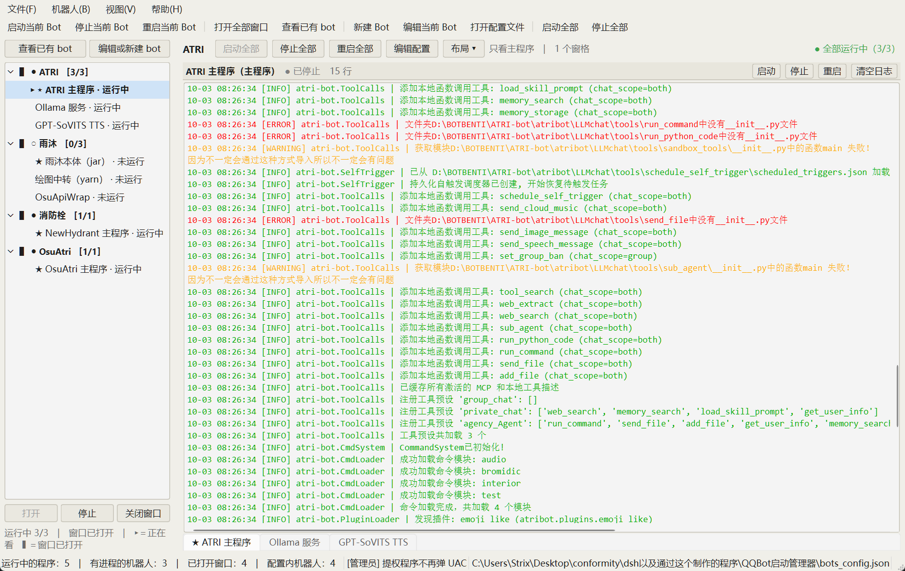
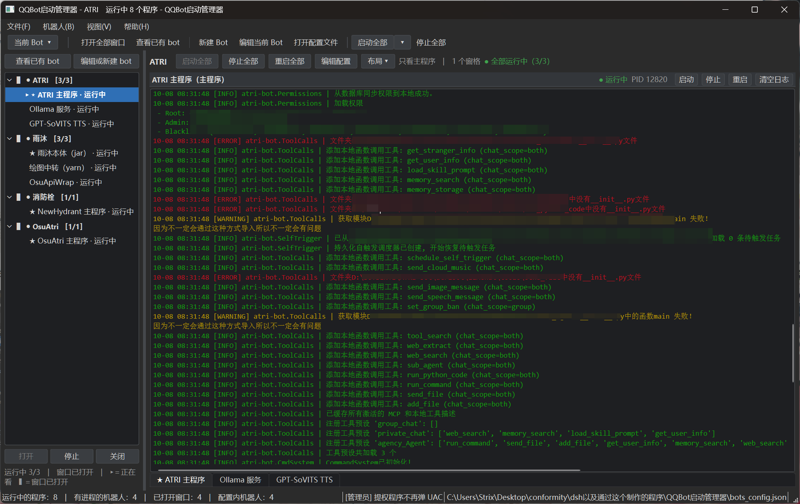

# QQBot 启动管理器

---

> **这是什么**：一个**个人用**的 Windows 桌面工具，把散落在各处的
> **QQ 机器人项目**（GitHub 上那些 `start.bat` / `nb run` / `java -jar` / `dotnet run`）
> 从"一堆 cmd / 终端窗口"统合成**一个窗口**里管理：一个窗口里看所有机器人的日志、
> 一键启停、按分屏模板排版、记住每个实例的界面状态。
>
> 它不是 bot 框架，也不会替你运行机器人逻辑 —— 它只负责**启动、盯着、停掉**这些进程。

基于 **PyQt6 + QProcess** 的 QQ 机器人启动管理器：一个机器人可以包含多个程序（主程序 + 若干副程序），
按配置顺序依次拉起、实时查看每个程序的日志、一键停止整棵进程树、自动选择最新的 jar 包。

### 它适合谁

| 你的情况 | 是否合适 |
| --- | --- |
| 本机跑着**多个** bot 项目（JRebel/NowBot、NapCat、NoneBot、ATRI、自研 Java/.NET…），每次开机要手动开一堆窗口 | ✅ 正中目标 |
| 一个 bot = 多个进程（本体 + TTS + 中转 + Ollama + 绘图 API…），启停顺序有讲究 | ✅ 支持"主程序 + 副程序"与启动间隔 |
| 只跑一个 bot、一个进程 | ⚠️ 可以用，但收益有限（写个 `.bat` 就够了） |
| 想要 Web 面板 / 跨平台 / 多用户 | ❌ 这是 Windows 桌面单机工具 |

> 本仓库里的示例配置（[bots_config.example.json](bots_config.example.json)）就取自
> 真实在用的 4 个实例：Java(jar) + Node(yarn) + .NET(dotnet) + Python(uv) + Ollama + 批处理，
> 可作为"怎么把一类 bot 接进来"的参照。

<a id="怎么跑起来先看这里"></a>
### 怎么跑起来（先看这里）

| 你的情况 | 做什么 |
| --- | --- |
| 只想用起来 | 把 exe 复制到**纯 ASCII 路径**（如 `C:\QQBotLauncher\`）双击；或双击 `启动（普通模式）.bat` |
| 有程序需要管理员权限 | 用 `启动（管理员模式）.bat` / 管理员版 exe（启动时弹**一次** UAC，之后不再弹） |
| 要排障、看输出 | 在项目目录执行 `python main.py`（窗口被占用，但能看到全部输出与报错） |
| 想要零控制台 | `python main.py --gui`（用 pythonw 脱离启动，屏幕上只剩界面） |

**完整的启动方式对比、打包 exe、安全警报处理、常见坑** →
[**启动方式说明.md**](启动方式说明.md)

---

#### 作者的话

【作者的话：本人不懂编程，只会看别人的readme，自己配置然后用ai辅助解决使用或者部署问题，该项目由dsh全程ai生成，模型为dsv4.1F，推理等级max，目前花了我7亿token（），大概没什么bug了，毕竟算是很小的项目了，我这边使用的py版本为Python 3.14.6】

【制作原因：存粹是我想用的QQbot有点多（笼统其实也就两个，但是这两个共6个窗口），而且晚上会关电脑，一个一个cmd打开也不太现实（不喜欢docker有点高的占用内存），尝试过用ds给我bat，但是感觉窗口太多了，有点难受加上对vibe coding有点感兴趣就做了这个】

【感想（？）：该项目可以认为是cmd或者终端托管程序（想得明白但是说的感觉不太清楚），某种意义上不局限于上面所说的（readme也是ai生成的，不用猜哪个是我写的:D，因为我写的基本上很容易分辨）】

【2026年10月1日（国庆节快乐）】

（以上这段是作者自己写的；本 README 其余部分由 AI 生成。）

---

<!-- TOC-BEGIN -->
## 目录

  - [它适合谁](#它适合谁)
  - [怎么跑起来（先看这里）](#怎么跑起来先看这里)
- [界面预览](#界面预览)
  - [颜色全部可以自己改](#颜色全部可以自己改)
- [功能一览](#功能一览)
- [环境要求](#环境要求)
- [一、安装依赖](#一安装依赖)
- [二、运行方法](#二运行方法)
  - [在 cmd 里启动时，那个窗口能关吗？](#在-cmd-里启动时那个窗口能关吗)
  - [0. 双击启动（推荐）](#0-双击启动推荐)
  - [1. 正常启动（图形界面）](#1-正常启动图形界面)
  - [2. 常用命令行参数](#2-常用命令行参数)
  - [3. 界面内的操作顺序](#3-界面内的操作顺序)
  - [3.1 界面布局（左侧竖栏 + 右侧实例区）](#31-界面布局左侧竖栏-右侧实例区)
  - [3.2 右侧分屏布局（每个程序一格 cmd/终端）](#32-右侧分屏布局每个程序一格-cmd终端)
  - [3.3 外观（浅色 / 深色 / 跟随系统）](#33-外观浅色-深色-跟随系统)
  - [3.4 配色工作台：整个界面的颜色都能自己调，改了立即生效](#34-配色工作台整个界面的颜色都能自己调改了立即生效)
  - [4. 配置文件是怎么写入的（先看这节）](#4-配置文件是怎么写入的先看这节)
  - [4.1 配置文件长什么样](#41-配置文件长什么样)
- [三、打包成无控制台 EXE（PyInstaller）](#三打包成无控制台-exepyinstaller)
  - [1. 安装 PyInstaller](#1-安装-pyinstaller)
  - [2. 一条命令完成打包](#2-一条命令完成打包)
  - [3. 用 spec 文件打包（推荐，便于重复构建）](#3-用-spec-文件打包推荐便于重复构建)
  - [3.5 一键打包（推荐）：两个"双击即用"的 exe](#35-一键打包推荐两个双击即用的-exe)
  - [4. 打包后怎么部署](#4-打包后怎么部署)
- [四、bots_config.json 放在哪里](#四botsconfigjson-放在哪里)
  - [界面状态的存放位置（QSettings）](#界面状态的存放位置qsettings)
  - [左侧列表的记忆规则（nav 前缀）](#左侧列表的记忆规则nav-前缀)
- [五、常见问题](#五常见问题)
  - [日志里那些 `[32;20m`、`[0m` 是什么？](#日志里那些-3220m0m-是什么)
  - [深色模式下日志文字是黑的？](#深色模式下日志文字是黑的)
  - [命令里带引号的参数、含空格的路径能正常启动吗？](#命令里带引号的参数含空格的路径能正常启动吗)
  - [切换日志区布局后日志内容没了？](#切换日志区布局后日志内容没了)
  - [窗格上的「启动/停止/重启」到底作用在哪些程序？](#窗格上的启动停止重启到底作用在哪些程序)
  - [「重启」在需要强制停止时没能重新启动？](#重启在需要强制停止时没能重新启动)
- [六、项目结构](#六项目结构)
- [七、问题反馈与贡献](#七问题反馈与贡献)
  - [先说明一下作者的情况（很重要）](#先说明一下作者的情况很重要)
  - [报 Issue（推荐，最省事）](#报-issue推荐最省事)
  - [提 PR（欢迎，但请体谅）](#提-pr欢迎但请体谅)
- [八、许可与免责](#八许可与免责)

> 每节都可以点标题跳到；`Ctrl+F` 搜索关键词也很快。
<!-- TOC-END -->

## 界面预览

配置好各个机器人、把实例都启动起来之后，界面大致就是这个样子
（同一台机器、同一批日志，两张只差一个外观设置）：
界面里**每一个部位的颜色、以及所有文字的颜色**都能自己调 —— 见下面第二张后面的说明。

**① 浅色模式**



**② 深色模式**（视图 → 外观 → 深色，切换立即生效，不用重启）



从上到下的结构：菜单栏 → **一行工具栏** → 左边机器人列表 + 右边日志窗格 →
底部标签栏（在已打开的内容之间切换）→ 状态栏（运行中的程序数、配置文件路径等）。

> 截图里的机器人名、程序组成、路径都是作者本机的配置，和你的不一样是正常的。
> 日志区底色实测取色：浅色 `#f0efe9`、深色 `#1e1f22`
> （浅色下日志底色与窗口底色是**同一个颜色**，这是有意为之、不是漏改 —— 见
> [深色模式下日志文字是黑的？](#深色模式下日志文字是黑的)）。
>
> 想把自己的截图贴进 Issue / PR：记得先给日志脱敏（token、QQ 号、内网地址），
> 对照表见[报 Issue（推荐，最省事）](#报-issue推荐最省事)。

### 颜色全部可以自己改

上面两张图里**每一处的颜色**都不是写死的：窗体 / 工具栏、左侧机器人列表、日志区、
窗格边框，以及**主文字、次要文字、禁用文字、选中行文字、强调色上的文字、日志文字**
—— 再加上日志里 16 种 ANSI 颜色，**深浅两套各调各的**。

打开方式：**视图 → 外观 → 配色工作台…**，点色块开取色器即可，
**改一下主界面立即跟着变，不用重启**；满意的配色点「保存」，
最多留 12 条**配色记录**，随时能套回去。详见
[3.4 配色工作台](#34-配色工作台整个界面的颜色都能自己调改了立即生效)。

---

## 功能一览

- **顶部只有一行工具栏**（顺序按"用得多 → 全局"，同一动作只挂一次）：
  **「当前 Bot ▾」**（下拉：对当前 Bot 的 启动/停止/重启 + 对当前程序的 启动/停止/重启）▏
  **打开全部窗口** · 查看已有 bot…（=按需挑一个打开）▏
  新建 Bot · 编辑当前 Bot · 打开配置文件 ▏**「启动全部 ▾」** · 停止全部。
  它始终可用 —— 左栏折叠后就是它顶上来。
- **「当前 Bot ▾」一个下拉管两个层级**：点开是两组 —— 「对当前 Bot：<机器人名>」下的
  启动 / 停止 / 重启，以及「对当前程序：<程序名>」下的启动 / 停止 / 重启
  （当前程序 = 该窗口里获得焦点的那个窗格）。
  三个快捷键仍然独立可用：`F5` 启动、`Shift+F5` 停止、`Ctrl+R` 重启当前 Bot。
- **「启动全部 ▾」挑着启动**：顶部工具栏「启动全部」右边的小箭头会弹出一个**层级勾选**菜单
  —— 和左侧栏一样的层级（用缩进表示），勾选标记就是菜单原生的那一个（和「布局 ▾」同款）。
  点机器人那一行 = 整组勾选/取消，行尾写着「已选 n/m」；菜单里还有「全选 / 清空」，
  选完点「启动勾选的」即可。默认只勾当前机器人，所以"点开直接确定"仍然等于启动这个机器人；
  左边那个「启动全部」按钮行为不变（一键全启动）。
- **浏览器式窗口标签栏**：实例区顶部，可点、可关、可拖动排序。
  默认隐藏，**折叠左侧列表（Ctrl+L）或有已打开的窗口时自动出现**；
  也可用「视图 → 显示窗口标签栏」手动常显。一个窗口都没打开时不显示。

- **多机器人 / 多程序**：一个 Bot 可挂多个程序，角色分 `primary`（主程序）与 `secondary`（副程序）。
- **两种日志布局**：只有一个程序时直接一个大日志窗口；多个程序时上方是大主程序日志窗口、下方是副程序标签页（标签在底部），中间分割条可拖动调比例，双击恢复默认 65:35。
- **每个窗格只有一行标题栏**（程序名（角色）· 状态 · PID · 日志行数 · 启动/停止/重启/清空日志）：
  日志视图自己那行程序名与状态在窗格内**不再重复显示**，行数并入窗格标题栏 ——
  屏幕上信息不重样，日志区也因此多出一行可视高度。
- **实时日志**：`QProcess` 捕获输出后逐行上屏；编码优先 UTF-8、失败自动回退 GBK，跨块截断的汉字不会乱码。
- **还原终端的颜色**：机器人常常连管道里也照写 ANSI 转义序列，以前日志区会把它
  原样显示成 `ESC[32;20m…ESC[0m` 这种"乱码"；现在会被解析成真正的颜色
  （终端里 INFO 是绿的，日志区里也是绿的），序列本身不再出现。
  深浅两套色板：换个主题，日志会按新配色重画一遍（终端里的亮白/亮黄在浅色底上
  会被自动压暗，保证读得清）。认不出的参数按终端习惯忽略 ——
  真机日志里的 `ESC[38;20m` 是残缺的扩展色，Windows Terminal 也不管它，这里同样不管。
- **进程树停止**：Windows 下先 `taskkill /T /PID`，超时再 `taskkill /T /F /PID`，最后兜底 `QProcess.kill()`，避免 java 子进程变孤儿。
- **自动选最新 jar**：命令里写 `[LATEST_JAR]`（也兼容 `{jar}`），启动时替换为工作目录下修改时间最新的 `.jar`。
- **右键菜单**：日志区右键可对单个程序或全部程序执行 启动 / 停止 / 重启 / 编辑配置 / 清空日志 / 复制日志 / 打开工作目录 / 关闭本页。
- **界面记忆**：窗口大小位置、每个 Bot 的分割比例、当前选中的 Tab、上次打开的 Tab、左侧列表的折叠状态与宽度、启动间隔等通过 `QSettings` 保存。
- **三态外观**：跟随系统 / 浅色 / 深色，**切换立即生效**，全局只有一套调色板（跟随系统 = 读系统深浅后套用我们自己的对应配色）。
- **整界面配色可调**（视图 → 外观 → 配色工作台…）：**15 个界面角色 + 16 个 ANSI 颜色**，
  深浅各一套 —— 不只是底色，**文字色**（主文字 / 次要文字 / 禁用文字 / 选中行文字 /
  强调色上的文字 / 日志文字）也都在里面；**改一下立即生效**，
  「保存」写进设置并留下一条**配色记录**（最多 12 条，可随时套用回去）。
- **导航三态标记**：`▸ ` 全局唯一的"当前正在看的程序"、`▌ ` "已打开窗口的机器人"、蓝色高亮"选中行"，三者相互独立。
- **分屏布局**：每个 Bot 可选 6 种模板（单窗格 / 上下 / 左右 / 左宽右上下 / 左右下 / 全标签）或自定义树，比例与焦点都会记住。
- **安全退出**：关闭窗口时确认后统一停止所有进程，不留残余。
- **关闭时强制停止**（可选开关，**默认关**）：勾选后关掉管理器**不再询问**，
  直接 `taskkill /T /F` 结束所有正在运行的程序 —— 适合"我关管理器就是要它全停"。
  开关在 **视图 →「关闭时强制停止所有程序」**（运行参数里也有同一个）；
  用法与状态栏提示见 [「界面内的操作顺序」第 5 步](#3-界面内的操作顺序)。

---

## 环境要求

| 项目 | 要求 |
| --- | --- |
| 操作系统 | Windows 10 / 11（已针对中文 Windows 的 GBK 输出做过处理） |
| Python | 3.9 及以上（开发环境实测 3.14） |
| 依赖 | PyQt6 ≥ 6.6 |
| 其他 | 被管理的程序自身需要的运行时（如 Java、Python）需已装好并可从命令行调用 |

---

<a id="一安装依赖"></a>
## 一、安装依赖

推荐先建虚拟环境（可选但更干净）：

```bat
cd /d "路径\QQBot启动管理器"
python -m venv .venv
.venv\Scripts\activate
```

安装依赖：

```bat
python -m pip install --upgrade pip
pip install -r requirements.txt
```

`requirements.txt` 内容：

```
PyQt6>=6.6.0
```

> 说明：`QProcess`、`QSettings` 都属于 PyQt6，JSON 用 Python 标准库，因此没有其他第三方依赖。
> 若下载慢，可加国内镜像：`pip install -r requirements.txt -i https://pypi.tuna.tsinghua.edu.cn/simple`

---

<a id="二运行方法"></a>
## 二、运行方法

<a id="在-cmd-里启动时那个窗口能关吗"></a>
### 在 cmd 里启动时，那个窗口能关吗？

**直接敲 `python main.py` 时不能关** —— `python.exe` 会把那个 cmd 当作自己的控制台，
关闭控制台会通知附加的进程，管理器随之退出。三种做法：

| 做法 | 命令 | 说明 |
| --- | --- | --- |
| **只要界面（推荐）** | `python main.py --gui` | 用 `pythonw.exe` + `DETACHED_PROCESS` 脱离启动 → cmd 立刻回到提示符，**屏幕上只剩管理器界面**（零控制台） |
| **要一个自己的控制台** | `python main.py --console` | 重启一个带独立控制台的进程 → 会**多出一个控制台窗口**（想看日志时用） |
| **留在前台看输出** | `python main.py` | cmd 被占用，退出程序后才回到提示符（排障用） |

日常使用直接双击 `启动（普通模式）.bat` 即可，它用 `start "" pythonw.exe main.py`
分离启动，管理器不占用你的 cmd。

<a id="0-双击启动推荐"></a>
### 0. 双击启动（推荐）

| 方式 | 文件 | 控制台 | 需要 Python | 定位 |
| --- | --- | --- | --- | --- |
| **bat（主）** | `启动（普通模式）.bat` / `启动（管理员模式）.bat` | 会有（可设快捷方式"最小化运行"减轻） | 是（脚本自动挑选带 PyQt6 的解释器） | **日常 + 排障** |
| **exe（可选）** | `dist\QQBot启动管理器.exe` / `（管理员）.exe` | **无** | 不需要（自带依赖） | 打包后最省事；**路径必须纯 ASCII** |
| pyw（实验） | `启动管理器（普通）.pyw` / `（管理员）.pyw` | **无** | 是（靠 `.pyw` 关联到 `pyw.exe`） | 想零控制台时试 |

**两个必须知道的坑**（都会在这两个文件里详细说明）：

1. **exe 所在路径不能含中文** —— PyInstaller 的引导程序用窄字符 API 创建
   `%TEMP%\_MEIxxxx`，中文路径会直接报
   `Error: Could not create temporary directory!`。
   解决：把 exe 复制到 `C:\QQBotLauncher\` 这类纯 ASCII 目录再运行。
2. **双击 `.bat` 可能弹「无法验证发布者」** —— 这是 Windows 对未签名脚本的通行确认。
   点「运行」即可；想彻底不弹，把项目目录加入 Defender 排除项。

管理员模式的价值：启动时弹**一次** UAC，之后需要提权的程序（如消防栓的 HttpListener）
**不再弹窗**（子进程继承管理员令牌）。普通模式下每启动一次就弹一次。

细节（含"让 cmd 窗口变得不重要"的做法、exe 打包、安全警报的三种解法）见
[启动方式说明.md](启动方式说明.md)。

<a id="1-正常启动图形界面"></a>
### 1. 正常启动（图形界面）

```bat
cd /d "路径\QQBot启动管理器"
python main.py
```

首次运行会自动在项目根目录生成 `bots_config.json`（示例机器人 + 主/副两个程序）。
仓库里**不含** `bots_config.json`（它保存着你本机的绝对路径与个人配置），
只提供 [bots_config.example.json](bots_config.example.json) 供参考字段结构。

### 2. 常用命令行参数

```bat
python main.py --config "D:\bots\my_config.json"   :: 指定配置文件（也可以在 GUI 里用「打开配置文件」查看）
python main.py --bare                              :: 只做自检，输出摘要后退出（不开窗口）
python main.py --selftest                          :: 同上（--bare 的别名）
python main.py --theme dark                        :: 本次运行用深色界面（不写入偏好）
python main.py --theme light                       :: 本次运行用浅色界面
python main.py --theme dark --remember-theme       :: 用深色，并把偏好记住（下次启动继续用）
python main.py --theme-debug                       :: 打印外观诊断（系统深浅 / 实际方案 / 调色板亮度），并写 theme_debug.log
python main.py --elevate                           :: 以管理员身份重启自己（弹 1 次 UAC）；之后提权程序不再弹窗
python main.py --console                           :: 申请独立控制台：关掉启动它的 cmd 也不影响管理器
python main.py --elevate --keep-console            :: 同上，但保留控制台窗口（便于看输出）
python main.py --nav-debug                         :: 记录左侧列表时序诊断（写 nav_debug.log）
python main.py --doctor                            :: 逐个导入所有模块并检查，定位"启动即报错"用
python main.py --help                              :: 查看用法
```

环境变量方式（与 `--config` 等价，命令行优先）：

```bat
set QQBOT_CONFIG=D:\bots\my_config.json
python main.py
```

`--theme` 的取值：`system`（跟随系统，默认）/ `light` / `dark`，也接受 `深色`、`浅色` 这类中文写法。

**诊断参数什么时候用**：

| 参数 | 输出 | 用来排查 |
| --- | --- | --- |
| `--theme-debug` | 控制台 + `theme_debug.log` | 界面颜色不对：会打印「系统深浅 / 实际采用方案 / `styleHints` / Window 亮度 / 是否自建调色板」 |
| `--nav-debug` | `nav_debug.log` | 左侧栏高亮被重建抹掉、折叠状态不对 |
| `--doctor` | 控制台 | 启动即报 `ImportError` / `NameError`（逐个模块导入） |

改完代码想一次跑完所有自检：

```bat
python tools\run_all_checks.py          :: 29 个检查器一次跑完，末尾汇总
python tools\run_all_checks.py -v       :: 额外打印每个检查器的完整输出
tools\run_all_checks.bat                :: 同上，双击也能跑（自动切 UTF-8 控制台）
```

> **中文 Windows 的编码坑**（真机踩过）：cmd 默认是 cp936，检查器输出里的个别符号
> （`▸` `⇄` `✓`）编不出来，会让**检查器自己崩在 print 上**。现在两头都堵住了：
> 每个检查器都有 `sys.stdout.reconfigure(errors="replace")` 兜底；
> `run_all_checks.py` 给子进程统一设 `PYTHONIOENCODING=utf-8`；
> `tools\run_all_checks.bat` 还会 `chcp 65001` 让控制台本身也吃 UTF-8。
> 这条也由 `tools\check_console_output.py` 盯着。
>
> **跑的时候怎么知道还没跑完**（真机反馈：有几个检查器要跑十几秒，屏幕没动静，
> 看着像跑完了、顺手把窗口关了 —— 其实还剩一堆）。所以现在的输出长这样：
> ```text
> 共 29 个检查器（其中 3 个因缺 PyQt6 跳过），单个超时 180 秒
> ====================…（跑的时候这里有一行原地刷新的进度）====================
>   [ OK ] [ 7/27] check_restart_flow.py             0.3s  结果： 全部通过
> ====================…
> 通过 27 · 失败 0 · 跳过 0（共 27 个，总耗时 1m12s）
> 最慢的几项：check_restart_force.py 18.4s　check_alloc_console_live.py 9.1s　…
>
> 全部跑完。可以放心关窗口了。
> ```
> 跑的过程中那一行会显示 **进度条 + `[ 7/27]` 序号 + 百分比 + 已跑时间**（每 0.2 秒刷新）；
> 单个检查器超过 180 秒会被强制结束（连它拉起的进程树一起收，免得留窗口）。
> 想改超时：`python tools\run_all_checks.py --timeout 300`。

`tools\diagnostics\` 下还有几个只读诊断脚本（颜色 dump、主题自检、日志区像素取色），
详见 [tools/diagnostics/README.md](tools/diagnostics/README.md)。

### 3. 界面内的操作顺序

1. 工具栏 **新建 Bot** → 填 Bot 名称，点「添加」增加程序，逐项填写：

   | 字段 | 说明 |
   | --- | --- |
   | 程序名称 | 仅用于显示，例如 `主程序`、`签名服务` |
   | 角色 | `primary` 主程序 / `secondary` 副程序（决定分屏位置与启动顺序） |
   | 工作目录 | 支持「浏览…」选择；相对路径以 `bots_config.json` 所在目录为基准 |
   | 启动命令 | 例如 `java -jar [LATEST_JAR]`、`python main.py --port 8080` |
   | 环境变量 | 键值对表格，例如 `JAVA_TOOL_OPTIONS = -Dfile.encoding=UTF-8` |
   | 启动延迟 | 该程序在同一次启动中等待多少秒后再拉起 |
   | 自动选最新 jar | 勾选后按修改时间取工作目录下最新的 `.jar` |
   | 通过命令解释器启动 | 勾选后整条命令交给 `cmd.exe /c` 执行，这样才能用 `&&`、`|`、`>`、`chcp` 等 cmd 语法，例如 `chcp 65001 >nul && yarn start` |

> **命令写法小抄**
> - 直接启动可执行文件（默认，不勾选）：`java -jar [LATEST_JAR]`、`uv run main.py`、`dotnet run --project OsuApi.csproj`
> - 需要 `&&` / 管道 / 重定向 / `chcp`：勾选「通过命令解释器启动」，命令写 `chcp 65001 >nul && yarn start`
> - `.bat` / `.cmd` 脚本无需勾选，程序会自动用 `cmd.exe /c` 包裹
> - 环境变量请填在「环境变量」表格里（用 `SET X=Y && ...` 写进命令只在该条命令内有效，且容易踩引号的坑）
> - 需要管理员权限的程序（例如消防栓 NewHydrant）：**把提权写进一个 `.bat`**，放进
>   `scripts\` 目录，命令填 `cmd.exe /c 你的脚本.bat`、工作目录填 `scripts`。
>   不要试图把 `powershell -Verb RunAs ...` 直接写进命令里 —— 引号要过三层解释，
>   实测会变成"命令被打印出来、程序没启动、退出码还是 0"。
>   模板与踩坑清单见 [`scripts/README.md`](scripts/README.md)

2. 点 **保存** → 配置立即写入 `bots_config.json`。
3. 点 **启动当前 Bot**（或右键菜单「启动」）→ 自动打开 Tab 并依次拉起程序。
4. 需要改配置时点 **编辑当前 Bot**，或在日志区右键「编辑配置」。
5. 退出：直接关窗口即可 —— 默认会问一句「仍有 N 个程序在运行」，确认后统一停止；
   想让它**不询问、直接强停**，见下面「退出时强制停止」。

> **退出时强制停止**（`视图 →「关闭时强制停止所有程序」`，运行参数里也有同一个开关）
>
> 适合"关掉管理器就是要所有 bot 全停"的用法。勾选后：
>
> 1. **状态栏立刻提示** `关闭管理器时将强制停止所有程序`
>    （取消勾选则提示 `关闭管理器时将先询问再停止所有程序`）——
>    不用点确定，设置立即写入注册表 `process/force_stop_on_close`；
> 2. 之后关窗口（✕ / `Alt+F4`）**不再弹确认框**：状态栏显示
>    `正在强制停止所有程序…`，日志区出现
>    `强制停止模式：跳过确认与优雅等待`，窗口随即关闭；
> 3. 下次打开管理器时菜单项的**勾选态自动还原**成上次的选择
>    （注册表里存的是 `'true'`/`'false'` 字符串，程序用 `settings_bool()` 解析）；
> 4. 想恢复"先询问再停止"：取消勾选即可。
>
> 与默认方式的差别：默认先 `taskkill /T`（礼貌请求）并按「停止超时」等待程序自行退出；
> 勾选后跳过优雅等待、直接 `taskkill /T /F` 结束整棵进程树，关窗更快更干脆 ——
> 代价是程序没有机会做退出前的清理。

> 快捷键：`Ctrl+N` 新建 · `Ctrl+E` 编辑 · `Ctrl+B` 查看已有 bot · `F5` 启动当前 Bot ·
> `Shift+F5` 停止 · `Ctrl+R` 重启 · `Ctrl+Shift+O` 打开配置文件 · `F6` 重新载入配置 ·
> `Ctrl+W` 关闭当前窗口 · `Ctrl+Shift+W` 关闭全部窗口 · `Ctrl+L` 折叠/展开左侧列表 ·
> `Ctrl+Shift+D` 浅色 ⇄ 深色 快切 · `Ctrl+Tab` / `Ctrl+Shift+Tab` 切换窗口 ·
> `Ctrl+1`…`Ctrl+9` 跳到第 N 个机器人

> 鼠标：左栏**单击**条目＝打开对应窗口并聚焦那个程序（高亮随 `▸` 落位）· **Ctrl/Shift+单击**＝只选中 ·
> **双击机器人条目**＝展开/折叠该节点 ·
> 每个窗格标题栏可单独 启动/停止/重启/清空 · 日志区右键＝菜单（含「布局」） ·
> 左栏右键＝菜单（含「分屏布局」） · 拖动窗格之间的分割条＝调比例 · 双击分割条＝恢复默认比例

> 左侧列表的状态符号：`●` 运行中 · `◐` 启动中/停止中/部分运行 · `○` 未运行 · `!` 异常；
> `［2/3］` 表示 3 个程序里有 2 个在运行；`★` 为主程序。
> 菜单「帮助 → 状态图例与快捷键…」里有同一份说明。

<a id="31-界面布局左侧竖栏-右侧实例区"></a>
### 3.1 界面布局（左侧竖栏 + 右侧实例区）

```
┌─────────────┬──────────────────────────────────────────────┐
│ 查看已有 bot │                                              │
│ 编辑或新建 bot│            右侧实例区                        │
├─────────────┤   （当前机器人的日志：单程序一个大窗口；      │
│ ● ATRI ［2/3］│     多程序上主下副，中间可拖动分割条）        │
│   ★ 主程序 运行中│                                          │
│     ollama  未运行│                                        │
│     gptsovits 运行中│                                      │
│ ● OsuAtri ［0/1］│                                          │
├─────────────┤                                              │
│ 打开 停止 关闭窗口│                                          │
└─────────────┴──────────────────────────────────────────────┘
```

- **左侧竖栏**：列出配置里的**全部**机器人（不只是打开了的）。每个机器人一行显示状态圆点与运行计数，
  展开后能看到每个程序的状态（★ 表示 primary 主程序）。
  **左键单击**机器人条目即打开它的窗口（焦点落在主程序窗格，高亮也落到主程序那一行）；
  **单击某个程序条目**则打开窗口并把焦点切到该程序的窗格（必要时自动切到对应标签页）；
  按住 **Ctrl 或 Shift 单击**只选中、不打开窗口（方便浏览列表）；
  **双击机器人条目** = 展开 / 折叠该节点（双击程序条目无副作用）。
**点顶部标签栏** = 切到那个机器人的窗口（等价于在左栏点它，高亮同样落到它的焦点程序行）；
标签上的 ✕ = 关闭该窗口（有程序在跑会先询问）；右键标签栏 = 关闭这个/其它/全部窗口。
- **关闭窗口 ≠ 停止程序**：点「关闭窗口」（或 `Ctrl+W`）只关界面，程序继续在后台运行，
  左侧列表仍会显示它"运行中"；要结束进程请点「停止」。
- 窗口全部关掉之后，右侧显示空状态页（可一键新建 / 查看已有 bot / 打开全部窗口）。
- 左栏右侧的分割条可拖动调整宽度；`Ctrl+L` 或「视图 → 折叠左侧列表」可整栏折叠；
  宽度比例、展开的机器人、当前窗口都会记入 QSettings，下次启动自动恢复。

<a id="只启动其中几个程序启动全部"></a>
#### 只启动其中几个程序（顶部「启动全部 ▾」）

顶部工具栏「启动全部」右边那个小箭头，会弹出一个**树形勾选**菜单
（点「启动全部」文字本身还是一键全启动，行为没变）：

```
选择启动的程序                        ← 小标题（灰，不可点）
✔ ATRI  （当前）· 已选 3/3            ← 打勾 = 这组全启动；点一下 = 整组切换
      ATRI 主程序  （主程序）          ← 子项只靠缩进，不用制表符号
      Ollama 服务
      GPT-SoVITS TTS
  雨沐  · 已选 2/3                    ← 只勾一部分时不打勾，行尾写清选了几个
      雨沐本体（jar）  （主程序）
      绘图中转（yarn）
──────────────────
全选
清空
──────────────────
启动勾选的
```

> 长相刻意和「布局 ▾」「视图」那些下拉**完全一致**（都是菜单原生项：同一个勾选列、
> 同一套行高与悬停高亮）。第一版为了把勾选框放右边自己画控件，看着很违和 —— 已改回原生。

- 勾/取消**机器人**那一行 → 它下面的程序跟着一起变；子项只勾一部分时，父项显示**半选**；
- 点整行也能切换勾选（不用瞄准那个小方框）；
- 默认只勾**当前机器人**（所以你点开直接确定 = 启动这个机器人），想跨机器人一起启动点「全选」；
- 打灰的程序是配置里 `enabled=false` 的，不会被启动；
- 菜单太长会在内部滚动，不会顶出屏幕。

<a id="32-右侧分屏布局每个程序一格-cmd终端"></a>
### 3.2 右侧分屏布局（每个程序一格 cmd/终端）

一个机器人有多个程序时，右侧可以切成若干**窗格**，每个窗格显示某一个程序的
cmd / 终端实时输出（就是日志面板本身，按程序 key 分发，彼此独立、互不串台）。

```
上下分屏（默认，主程序在上）        左右分屏（主程序在左）
┌───────────────────────────┐      ┌─────────────┬─────────────┐
│ ● 主程序（主程序） 运行中   │      │ ● 主程序     │ 标签页：     │
│   [启动][停止][重启][清空] │      │             │ ollama │ tts │
│   ── cmd 输出 ──           │      │  cmd 输出    │  cmd 输出    │
├───────────────────────────┤      │             │             │
│ 标签页： ollama │ tts      │      │             │             │
│   ── 当前标签的 cmd 输出 ──│      │             │             │
└───────────────────────────┘      └─────────────┴─────────────┘
```

**六个模板**（`视图 → 分屏布局` / 日志区右键 `布局` / 左栏右键 `分屏布局` / 控制条「布局 ▾」）：

| 模板 | 说明 |
| --- | --- |
| `上下分屏（主程序在上）` | 默认。上半格主程序独占，下半格其余程序做成底部标签页 |
| `左右分屏（主程序在左）` | 左右两格；右侧仍是其余程序的标签页 |
| `左右分，左侧再上下分` | 先左右切，左格再上下切成两格（共 3 格） |
| `左右分，右侧再上下分` | 先左右切，右格再上下切成两格（共 3 格） |
| `单窗格 + 全部标签` | 只留一格，所有程序用底部标签切换（省屏幕） |
| `只看主程序` | 只显示主程序一格，其它程序不占空间（仍可在左栏操作它们） |

- **每个窗格自带标题栏**：`程序名（角色） · 状态圆点 · PID`，右侧是 `启动 / 停止 / 重启 / 清空日志`
  四个小按钮——只作用于该窗格里的程序，互不影响。
- **拖动分割条**调整比例；比例按"分割节点路径"记住（例如 `h0`、`h0/v1`），下次打开同一布局即还原。
- **窗口没打开也能先设**：菜单里选布局会先记进 QSettings，并提示"打开窗口后生效"。
- **建 Bot 时就能选**（N4）：`新建 Bot` / `编辑当前 Bot` 对话框里的 **「布局模板」** 下拉，
  可选 `自动（按程序数量决定）` 或上面六个模板之一 —— 保存后：
  - 该机器人的窗口**已经打开** → 立刻切换成所选布局；
  - **还没打开** → 记进 QSettings，下次打开就按它构建；
  - 选 `自动` → 删掉该机器人的布局记忆，回到默认规则（1 个程序单窗格 / 2 个上下分 / 3 个以上主程序在上）。
- **应用到全部机器人**：菜单里的这一项会把当前模板套到所有机器人。
- **自定义布局**（拖出来的布局）会自动识别为 `custom` 并把整棵树记进 QSettings；
  如果某个机器人当前是 `custom`，编辑对话框的下拉里会**多出**一项「自定义（拖出来的布局）」，
  选它即保持自定义布局不变。
- 布局属于**本机界面偏好**，**不写进 `bots_config.json`**：换机器导入同一份配置时，
  布局按新机器的习惯从默认开始；想清空某个机器人的布局记忆，用菜单里的「恢复默认布局」
  或在编辑对话框里选「自动」。

> 小技巧：程序很多时用「单窗格 + 全部标签」省地方；盯两个程序时用「左右分屏」；
> 三个程序想看全部时用「左右分，右侧再上下分」。

<a id="33-外观浅色-深色-跟随系统"></a>
### 3.3 外观（浅色 / 深色 / 跟随系统）

三种模式，**切换立即生效**（不用重启，也不用点确定）：

| 模式 | 说明 |
| --- | --- |
| **跟随系统**（默认） | 读 Windows 的浅色/深色偏好，然后套用**我们自己的**对应配色；在系统里切换主题时，界面约 2 秒内自动跟着变 |
| **浅色模式** | 始终浅色：柔和黄灰底（`#f0efe9`）＋ 近黑字（`#1f1f1f`）；日志区**与主体同色**（`#f0efe9`，不是白底，见下方说明） |
| **深色模式** | 始终深色：窗口 `#2b2b2b`、日志区 `#1e1f22`、文字 `#d6d6d6` |

**四个切换入口**：

| 入口 | 位置 |
| --- | --- |
| 菜单 | **视图 → 外观** → 跟随系统 / 浅色模式 / 深色模式（单选，展开时同步勾选） |
| 快捷键 | **`Ctrl+Shift+D`** 在浅色 ⇄ 深色之间快切（切到显式模式后就不再跟随系统） |
| 运行参数 | **视图/工具栏 → 运行参数** → 「外观」下拉（**改动立即生效**，不需要点确定） |
| 命令行 | `python main.py --theme dark`（临时覆盖，不写偏好）；加 `--remember-theme` 才记住 |

> 两种外观的实际界面截图见上面的[界面预览](#界面预览) —— 同一批日志、同一个界面，只差这一个设置。

- **记忆位置**：偏好写在注册表的 `ui/theme`（`system` / `light` / `dark`），属于**本机界面偏好**，
  不会写进 `bots_config.json`；想回到跟随系统，选菜单里的「恢复为跟随系统」或删掉这个键。
- **启动不闪屏**：外观在创建主窗口**之前**就应用好了，所以选了深色不会先亮一屏再变暗。
- **配色永远是"我们自己的两套"**：程序不会把调色板交还给系统。
  跟随系统只是"读一次系统偏好（深/浅），然后套用对应那套"——
  这样全局任何时刻只有**一套**调色板，不会出现"系统色 / 我们的色 / 菜单栏自己的色"三套打架。
- **哪些地方会跟着变**：菜单栏、工具栏、左栏（列表/按钮/提示）、空状态页、
  每个窗格的标题栏与焦点边框、日志区、状态栏、所有已打开的对话框
  （含「查看已有 bot」表格里的状态色）；运行中切换时已打开窗口与对话框都会**当场**刷新。
- **日志区配色**（跟随主题，深浅两套）：
  - **浅色**：底色 `#f0efe9` —— **故意与界面主体同色**（不是纯白），配近黑字 `#1f1f1f`。
    这样日志区与窗体连成一片，不会在浅色界面里"挖"出一块刺眼的白方块；
    深色模式下它才比窗口更深（`#1e1f22`）以形成层次。这是有意设计，不是漏配。
  - **深色**：底色 `#1e1f22`、文字 `#d6d6d6`。
  - 着色方式是**控件调色板 + 样式表双写**（不只靠样式表），所以切换后一定会重绘，
    也不会出现"深色下日志文字是黑的"那种情况。
  - **日志里的终端颜色也跟着主题走**（ANSI 16 色两套色板）：深色照搬 Windows Terminal
    的配色，浅色把过亮的颜色压暗，保证在 `#f0efe9` 上读得清。切换主题时日志会
    按新色板**重画一遍**，不会把深色下的亮黄亮白留在浅色底上。
    浅色板的深度是**按 WCAG 对比度定**的（真机反馈"颜色深些观感更好"之后调过一版）：
    基础色 1-6 达到 8:1 左右（与正文同级），亮色 9-14 约 6:1（仍保留"亮一档"的语义），
    灰阶则**故意反着来** —— 终端里的"亮白"在浅底上等于隐形，这里换成深灰。
    改色板前先跑 `python tools\check_ansi_log.py`，它会逐个算对比度。
    详见[日志里那些 `[32;20m`、`[0m` 是什么？](#日志里那些-3220m0m-是什么)。
- **菜单栏使用 Qt 自绘**：为了让菜单栏颜色可控（Windows 原生菜单栏不跟随应用主题，
  曾出现"深色模式黑字 / 浅色模式白字"），程序关闭了原生菜单栏
  （`setNativeMenuBar(False)`）。代价是没有系统菜单栏的圆角与动画。
- **状态颜色不受主题影响**：`●` 运行中的绿、`◐` 启动中的黄、`!` 异常的红在三套配色下都一样，
  方便一眼判断，只是文字/底色的明暗会跟着主题走。

> 小技巧：晚上挂机时按 `Ctrl+Shift+D` 切深色；白天想看日志细节再按一次切回浅色。
> 如果你希望"我手动选过就固定下来"，那就别选「跟随系统」——显式模式下程序会忽略系统主题变化。

**排查颜色问题**：

```bat
python main.py --theme-debug
```

会打印类似（同时写入 `theme_debug.log`）：

```
[启动-应用外观后] mode=system 系统=light 实际=light hint=light scheme=light Window亮度=237 调色板偏深=False 自建调色板=True
```

字段含义：

| 字段 | 说明 |
| --- | --- |
| `mode` | 你选的模式（`system` / `light` / `dark`） |
| `系统` | 从 Windows 读到的真实偏好（`os_scheme()`，读注册表 `AppsUseLightTheme`） |
| `实际` | **真正生效**的方案（永远是 `light` / `dark`） |
| `hint` | `QStyleHints.colorScheme()` 的值（会被我们自己设过，仅作参考） |
| `Window亮度` | 调色板 Window 角色的亮度：深色应 < 128、浅色应 ≥ 128 |

<a id="34-配色工作台整个界面的颜色都能自己调改了立即生效"></a>
### 3.4 配色工作台：整个界面的颜色都能自己调，**改了立即生效**

**界面里每一个部位的颜色和文字颜色，全都能改**（深浅两套各调各的）。

内置配色是按 **WCAG 对比度**配的（浅色板基础色 ≥ 8:1、亮色 ≈ 6:1），
但"顺不顺眼"是主观的，而且**底色一换、合适的颜色就跟着变** —— 所以做了个工作台：

| 打开方式 | 说明 |
| --- | --- |
| **视图 → 外观 → 配色工作台…**（推荐） | 在运行中的管理器里调：**改一下立即生效** —— 主界面、已打开的实例窗口、日志、菜单栏、工具栏一起变，不用重启 |
| `python tools\palette_studio.py` | 独立窗口（管理器没开时也能调；`dark` 参数先看深色）。两边是**同一个对话框**，界面代码只有一份 |

窗口里是这样的：

| 位置 | 是什么 |
| --- | --- |
| 左侧上半 | **真的日志控件**（和主界面同一套控件、同一条上色代码），里面是 16 个 ANSI 颜色各一行 + 一段真实日志；每行末尾写着它和日志底色的 **WCAG 对比度**，低于 4.5 会标「偏淡」 |
| 左侧下半 | **界面样例**：列表（含选中行）、按钮、禁用按钮、输入框、次要文字 —— 就是左栏那几种控件 |
| 右侧 | **15 个界面角色** + **16 个 ANSI 颜色**，点色块开取色器，改完立刻重画；该看对比度的地方标数字，不达标红框 |
| 按钮 | 撤销 · 恢复内置 · **保存** · 清除自定义 · 复制为代码 |
| 配色记录 | 每次「保存」自动记一条（时间 + 改了几项 + 深浅模式），最多留 **12 条**；选中后点「套用这条」立刻回到那套配色，也可以「清空记录」 |

- **能改的**（深浅两套各自独立）：窗体 / 工具栏、**列表 · 输入区**、悬停、主文字、
  次要文字、按钮底色、边框、强调色、强调色上的文字、**列表选中行**与它的文字、
  禁用文字、窗格焦点边框、日志区底色、日志区文字，外加 16 个 ANSI 颜色。
- **不在这里改的**：状态色（`● 运行中` 的绿、`◐ 启动中` 的黄、`!` 异常的红）——
  它们是"语义色"，三套配色下都一样，故意不跟着主题走。
- **「保存」只写"与内置不同"的项**，键名形如 `colors/light_base`、`colors/dark_ansi`，
  下次启动自动带上；想回内置点「恢复内置」或「清除自定义」。
- 换个底色多比几轮常常有惊喜：这层偏暖的 `#f0efe9` 会让蓝/青显脏，换成 `#eef2f6` 会好很多。

> 想知道"为什么是这样配的"：`python tools\check_ansi_log.py` 会把两套 ANSI 色板逐个算对比度；
> `python tools\check_palette_studio.py` 盯着整条链路：**菜单入口 → 对话框 → 立即生效 →
> 存设置 → 启动载入 → 配色记录**，以及**每个角色是否真的可覆盖**（15 个角色逐个试一遍）。

<a id="4-配置文件是怎么写入的先看这节"></a>
### 4. 配置文件是怎么写入的（先看这节）

`bots_config.json` **不需要你手写**。它有两条正道，按推荐顺序：

<a id="方式一在界面上新建-编辑推荐日常都用这个"></a>
#### 方式一：在界面上新建 / 编辑（推荐，日常都用这个）

程序**第一次运行**时，如果找不到 `bots_config.json`，会自动写入一份**默认配置**
（一个示例机器人 + 主/副两个程序），然后：

| 想做什么 | 怎么做 |
| --- | --- |
| 新建一个机器人 | 工具栏 **新建 Bot**（Ctrl+N），填名称、工作目录、程序与命令，点**保存** |
| 改现有机器人 | 左栏选中它 → **编辑当前 Bot**（Ctrl+E） |
| 删掉示例机器人 | 在编辑对话框里删除，或直接改 `bots_config.json` |
| 加一个程序 | 编辑对话框里「添加程序」；命令照抄你原来 `.bat` 里的那行即可 |

改动**立刻写盘**（编辑对话框点保存、删除机器人、导入配置等操作都会触发
`BotConfig.save()`），采用"先写临时文件再原子替换"的方式，写坏了也不会丢原文件。
文件若损坏，会被备份成 `bots_config.json.broken-<时间戳>` 并重建默认配置。

<a id="方式二直接编辑-json批量改-版本管理时用"></a>
#### 方式二：直接编辑 JSON（批量改 / 版本管理时用）

工具栏 **打开配置文件**（Ctrl+Shift+O）会用系统默认程序打开它；保存后在管理器的
**机器人**菜单里重新载入即可生效。

<a id="方式三从别处拷一份"></a>
#### 方式三：从别处拷一份

`bots_config.json` 就是一个纯 JSON，可以拷来拷去。注意两点：

- **路径基准**：`cwd` 与命令里的相对路径，都以 `bots_config.json` **所在目录**为基准
  （打包成 exe 后则是 exe 旁边），见「[四、bots_config.json 放在哪里](#四botsconfigjson-放在哪里)」；
- 想要一份现成的骨架，直接拷 [bots_config.example.json](bots_config.example.json)
  改名为 `bots_config.json`，再把里面的 `<占位符>` 换成你的路径。

> ⚠️ 仓库里**不含** `bots_config.json` —— 它保存着你本机的绝对路径与个人配置，
> 已写进 `.gitignore`。

### 4.1 配置文件长什么样

```json
{
  "version": 1,
  "shell": "cmd.exe",
  "start_interval": 1.0,
  "stop_timeout": 10.0,
  "log_max_lines": 2000,
  "bots": [
    {
      "id": "bot_1a2b3c4d",
      "name": "示例机器人",
      "qq": "123456789",
      "working_dir": "bots/example",
      "enabled": true,
      "auto_start": false,
      "programs": [
        {
          "id": "prog_11112222",
          "name": "主程序",
          "role": "primary",
          "cwd": "bots/example",
          "command": "java -jar [LATEST_JAR]",
          "env": { "JAVA_TOOL_OPTIONS": "-Dfile.encoding=UTF-8" },
          "delay": 0.0,
          "auto_latest_jar": true,
          "args": [],
          "enabled": true,
          "description": "主机器人本体"
        },
        {
          "id": "prog_33334444",
          "name": "副程序",
          "role": "secondary",
          "cwd": "bots/example",
          "command": "python plugin_host.py --port 8080",
          "env": { "PYTHONIOENCODING": "utf-8" },
          "delay": 5.0,
          "auto_latest_jar": false,
          "args": [],
          "enabled": true,
          "description": "插件宿主"
        }
      ]
    }
  ]
}
```

字段含义：`role` 决定谁是"主程序"（日志占据大窗格、`[LATEST_JAR]` 一般只给主程序用）；
`delay` 是启动前等待秒数（后面的程序用来等前面的端口就绪）；`via_shell` 为 `true` 时整条命令
交给 `cmd.exe /c`（`&&`、`|`、`>` 等语法原样生效）；`auto_latest_jar` 为 `true` 时把
`[LATEST_JAR]` 换成工作目录下最新的 `.jar`。

> 上面这些字段**全部由界面写入**：你在「新建 Bot / 编辑当前 Bot」里填什么，程序就按同样的
> 顺序写进这个文件（`indent=2`、UTF-8、先写临时文件再原子替换）。手工编辑当然也可以，
> 只是注意别写坏 JSON —— 写坏了会走"备份 + 重建默认配置"那条路。

文件损坏时程序会自动把它备份成 `bots_config.json.broken-<时间戳>` 并重建默认配置，不会直接丢数据。

---

<a id="三打包成无控制台-exepyinstaller"></a>
## 三、打包成无控制台 EXE（PyInstaller）

### 1. 安装 PyInstaller

```bat
pip install pyinstaller
```

### 2. 一条命令完成打包

在 **项目根目录**（含 `main.py` 的那一层）执行：

```bat
pyinstaller --noconfirm --clean --onefile --windowed ^
  --name "QQBot启动管理器" ^
  --paths . ^
  --hidden-import app --hidden-import app.config --hidden-import app.process_manager ^
  --hidden-import app.ui --hidden-import app.ui.main_window --hidden-import app.ui.bot_tab ^
  --hidden-import app.ui.program_widget --hidden-import app.ui.edit_bot_dialog ^
  --exclude-module tkinter ^
  main.py
```

- `--windowed`（等价于 `--noconsole`）：**不弹黑色控制台窗口**，双击即用。
- `--onefile`：打包成单个 exe；若希望启动更快，可去掉它，改用文件夹模式（`dist\QQBot启动管理器\`）。
- `--paths .`：让 PyInstaller 能找到 `app` 包；`--hidden-import` 逐条列出子模块，避免动态导入被漏掉。
- `--exclude-module tkinter`：减小体积（本项目不使用 Tkinter）。

如需自定义图标，追加（图标文件先准备好）：

```bat
  --icon "assets\app.ico"
```

打包结果：`dist\QQBot启动管理器.exe`。

<a id="3-用-spec-文件打包推荐便于重复构建"></a>
### 3. 用 spec 文件打包（推荐，便于重复构建）

先执行一次上面的命令生成 spec，然后把 `QQBot启动管理器.spec` 的内容改成下面这样，之后每次只需 `pyinstaller --noconfirm "QQBot启动管理器.spec"`：

```python
# -*- mode: python ; coding: utf-8 -*-
from PyInstaller.utils.hooks import collect_submodules

hidden = collect_submodules("app")

a = Analysis(
    ["main.py"],
    pathex=["."],
    binaries=[],
    datas=[],
    hiddenimports=hidden,
    hookspath=[],
    runtime_hooks=[],
    excludes=["tkinter"],
    noarchive=False,
)
pyz = PYZ(a.pure)

exe = EXE(
    pyz,
    a.scripts,
    a.binaries,
    a.datas,
    [],
    name="QQBot启动管理器",
    debug=False,
    bootloader_ignore_signals=False,
    strip=False,
    upx=True,
    console=False,          # 无控制台窗口
    disable_windowed_traceback=False,
    icon="assets/app.ico",  # 没有图标文件就删掉这一行
)
```

一行版（spec 已存在时）：

```bat
pyinstaller --noconfirm --clean "QQBot启动管理器.spec"
```

<a id="35-一键打包推荐两个双击即用的-exe"></a>
### 3.5 一键打包（推荐）：两个"双击即用"的 exe

本目录已带好全套 spec，直接用项目里的脚本即可：

```bat
python tools\build_exe.py            :: 前置检查 + 打包两个 exe
python tools\build_exe.py --check    :: 只做前置检查
python tools\build_exe.py --one      :: 只打普通模式
python tools\build_exe.py --admin    :: 只打管理员模式
```

产出（`dist\`）：

| 文件 | 控制台 | 权限 | 说明 |
| --- | --- | --- | --- |
| `QQBot启动管理器.exe` | 无 | 普通 | 需要提权的程序启动时弹一次 UAC |
| `QQBot启动管理器（管理员）.exe` | 无 | **管理员** | 内嵌 `requireAdministrator` 清单：双击弹**一次** UAC，之后提权程序不再弹 |

为什么推荐打包：

- **不再依赖"哪个 Python 装没装 PyQt6"** —— 解释器与依赖都打进 exe；
- 没有控制台窗口，也没有 `.bat` 的**脚本执行确认框**；
- 可以直接建快捷方式、放进 `shell:startup` 开机自启。

打包后：`bots_config.json` 会生成在 **exe 旁边**（`app/config.py` 里 `bundle_root()`
对 `sys.frozen` 做了特判），把 exe 连同 `scripts\` 一起复制到别处也能自洽运行。

> **⚠️ exe 所在路径必须不含中文**：PyInstaller 单文件 exe 启动时把自己解包到
> `%TEMP%\_MEIxxxx`，引导程序（运行在 Python 之前）用的是窄字符路径 API，
> 中文路径会导致 `Error: Could not create temporary directory!`。
> 把 exe 复制到 `C:\QQBotLauncher\` 这类纯 ASCII 目录再运行即可
> （`bots_config.json` 会生成在 exe 旁边）。

> 打包机需要 `pip install pyinstaller`（PyQt6 环境本身要有，`tools\build_exe.py`
> 会先检查这两项再动手）。

### 4. 打包后怎么部署

```
D:\QQBot\                       ← 建议的部署目录
├── QQBot启动管理器.exe          ← 打包产物，双击运行
├── bots_config.example.json    ← 配置示例（仓库不含真实配置）
├── .gitignore                  ← 忽略配置/日志/打包产物
├── LICENSE                     ← MIT 许可证
├── CONTRIBUTING.md             ← 贡献指南（Issue / PR / 自检要求）
└── bots\                       ← 各机器人的工作目录（按你的实际情况组织）
    └── example\
        ├── mirai-2.7.0.jar
        └── plugin_host.py
```

---

<a id="四botsconfigjson-放在哪里"></a>
## 四、bots_config.json 放在哪里

程序按下面的顺序定位配置文件，先命中先用：

| 优先级 | 位置 | 说明 |
| --- | --- | --- |
| 1 | 命令行 `--config <路径>` | 例如 `QQBot启动管理器.exe --config D:\bots\my.json`；也可直接给一个目录，程序会取该目录下的 `bots_config.json` |
| 2 | 环境变量 `QQBOT_CONFIG` | 值为文件路径或目录路径 |
| 3 | 上次使用过的路径 | 由 `QSettings` 记住（见下），GUI 里下次启动自动沿用 |
| 4 | **默认位置** | 源码运行：项目根目录（与 `main.py` 同级）<br>打包运行：**EXE 所在目录**（与 `QQBot启动管理器.exe` 同级） |

要点：

- **打包后不要把配置放在 exe 内部**：`--onefile` 的解包目录是临时目录，退出即删。本项目已处理这一点，
  打包运行时默认读写的就是 **exe 旁边**的 `bots_config.json`。
- 配置里的相对路径（`cwd`、命令中的相对路径）都以 `bots_config.json` **所在目录**为基准，
  所以整个目录可以整体搬到别的盘或别的机器。
- 文件不存在时会自动生成默认示例配置；也可以在 GUI 里点 **打开配置文件**（`Ctrl+Shift+O`）用记事本直接改，改完按 `F6` 重新载入。
- 希望换一份配置又不想动默认文件时，用 `--config` 或 `QQBOT_CONFIG` 指向新文件即可，程序会记住这个路径。

<a id="界面状态的存放位置qsettings"></a>
### 界面状态的存放位置（QSettings）

除配置文件外，程序还用注册表保存界面状态（不写任何文件）：

```
HKEY_CURRENT_USER\Software\QQBotLauncher\QQBot启动管理器
```

里面包括：

| 键 | 作用 |
| --- | --- |
| `window/geometry` / `window/state` | 窗口大小位置、工具栏/状态栏状态 |
| `window/current_bot` | 当前显示的机器人（旧版是 `window/current_tab`，只读兼容一次） |
| `open/bots` | 上次打开的机器人窗口列表（下次启动自动恢复） |
| `nav/split` · `nav/collapsed` · `nav/expanded` | 左侧列表的宽度、是否折叠、哪些机器人是展开的 |
| `pane/layout/<bot_id>` | 该机器人的分屏模板（`v`/`h`/`h_left_v`/`h_right_v`/`tabs`/`single`/`custom`） |
| `pane/tree/<bot_id>` | `custom` 布局的完整树（紧凑 JSON） |
| `pane/sizes/<bot_id>/<path>` | 各分割节点的比例（例如 `pane/sizes/bot_atri/h0`） |
| `pane/focus/<bot_id>` | 上次聚焦的程序（重开窗口时还原焦点） |
| `ui/theme` | 外观：`system` / `light` / `dark`（视图 → 外观，或 `--theme` + `--remember-theme`） |
| `split/<bot_id>` | 旧版单层分割比例，**只读兼容**：新键没命中时用它迁移一次 |
| `start/interval` · `process/stop_timeout` · `log/max_lines` | 「运行参数」里的三个数值 |
| `config/path` | 上次使用的配置文件路径（`--config` 会更新它） |
| `ui/hint_shown` | 是否已经提示过首次使用说明 |

<a id="左侧列表的记忆规则nav-前缀"></a>
### 左侧列表的记忆规则（nav 前缀）

| 键 | 含义 | 默认（无记录时） |
| --- | --- | --- |
| `nav/bot_tab_bar` | 是否手动常显实例区顶部的标签栏（左栏折叠时无论如何都显示） |
| `nav/collapsed` | 左侧列表是否折叠 | **展开** || `nav/split` | `[左栏宽度, 右侧宽度]`；只在**展开**时写入（不会存成 0） | 280 |
| `nav/expanded` | 哪些机器人节点是展开的（`\` 分隔的 id 串） | 全部展开 |

- 语义是**如实还原上次状态**：你折叠了，下次启动就是折叠；你展开了，下次就是展开。
- 宽度会被夹在 `[180, 640]` 之间（拖动再窄也不会变成"一条缝"）。
- 折叠状态下**不会**把 `0` 写进 `nav/split`，所以展开后宽度还是原来的值。
- `Ctrl+L` 或「视图 → 展开/折叠左侧列表」随时切换，状态立刻落盘。

> **实现提示（避免踩同一个坑）**：注册表里 QSettings 写的布尔读回来是**字符串**
> `'true'`/`'false'`，而 Python 里 `bool('false') is True`（非空字符串恒为真）。
> 所以读布尔一律走 `settings_bool()`（`app/ui/main_window.py`），
> 直接用 `bool(...)` 会把"展开"误判成"折叠"。

> **布局记忆在哪、怎么清**：布局与比例属于本机界面偏好，都在这份注册表里，
> **不会**写进 `bots_config.json`（所以换机导入配置时布局从默认开始）。
> 想只清布局：用菜单「恢复默认布局」，或删掉 `pane` 键：
> ```bat
> reg delete "HKCU\Software\QQBotLauncher\QQBot启动管理器\pane" /f
> ```
>
> **外观记忆**同理：想回到跟随系统，用菜单「外观 → 恢复为跟随系统」，或
> ```bat
> reg delete "HKCU\Software\QQBotLauncher\QQBot启动管理器\ui" /f
> ```
>
> **左侧列表记忆**：想恢复成"默认展开 + 280 宽"：
> ```bat
> reg delete "HKCU\Software\QQBotLauncher\QQBot启动管理器\nav" /f
> ```

想恢复出厂界面状态：删掉整个注册表项即可（配置文件和机器人列表不受影响）。

```bat
reg delete "HKCU\Software\QQBotLauncher\QQBot启动管理器" /f
```

---

<a id="五常见问题"></a>
## 五、常见问题

**1. 双击 exe 一闪而过 / 没有任何反应**
先确认是否是「无控制台 + 启动即崩溃」。临时排查办法：用命令行运行 `QQBot启动管理器.exe` 看输出，
或查看 exe 旁边的 `launcher_error.log`（程序会把未捕获异常写进这个文件）。

**2. 日志中文是乱码**
程序会先按 UTF-8 解码、失败回退 GBK，并且同一进程只判定一次编码。
如果被管理程序输出的是 UTF-16 等其它编码，建议在它的启动命令里显式指定编码，
例如给 Java 程序加环境变量 `JAVA_TOOL_OPTIONS=-Dfile.encoding=UTF-8`。

**3. 点「停止」后进程还在**
程序使用 `taskkill /T` 结束整棵进程树，若被杀进程以管理员权限运行，普通权限的 taskkill 会被拒绝（Access denied）。
解决办法：用管理员身份运行本管理器，或给被杀程序所在的目录加杀毒/安全软件白名单。

**4. 提示找不到 java / python**
`QProcess` 直接执行命令，不经过 `cmd /c`，因此命令必须在 `PATH` 中可直接调用。
两种解决方式：把 `java`/`python` 的完整路径写进命令，或在「环境变量」里补 `PATH`。

**5. 需要管道 / 重定向（`|`、`>`）**
默认是直接启动可执行文件，管道交由 cmd 处理。需要管道时把命令写成
`cmd.exe /c "xxx | yyy"`，或把可执行文件换成 `.bat` 脚本（程序会自动用 `cmd.exe /c` 包裹 `.bat`/`.cmd`）。

**6. 打包后提示缺少 Qt 平台插件**
本项目只用 QtCore/QtGui/QtWidgets，PyInstaller 官方钩子会自动带上 `platforms\qwindows.dll`。
若手工改过 spec 导致缺失，删掉 `build\` 与 `dist\` 重新打包，或改用文件夹模式（去掉 `--onefile`）。

**7. 想让程序开机自动启动**
把 exe 的快捷方式放进「启动」文件夹（`shell:startup`）。
注意：程序本身不会自动拉起机器人，启动后需要点「启动当前 Bot」或「启动全部」，以免在不知情时占用资源。

**8. 界面太亮 / 太暗，或者某个控件没跟着换色**
用 **视图 → 外观** 或 `Ctrl+Shift+D` 切一次即可（立即生效，已打开的窗口和对话框都会跟着刷）；
具体见 [§3.3 外观](#33-外观浅色-深色-跟随系统)。

排查顺序（先看数值，别靠肉眼猜）：

1. `python main.py --theme-debug` —— 看「系统 / 实际 / Window亮度」三个字段。
   深色应 < 128、浅色应 ≥ 128；`实际` 必须与 `Window亮度` 一致。
2. 若菜单栏颜色不对（例如深色下是黑字）：程序已改为 **Qt 自绘菜单栏**
   （`setNativeMenuBar(False)`），因为 Windows 原生菜单栏不跟随应用主题，
   会出现"深色模式黑字 / 浅色模式白字"。
3. 若右侧**日志区**不跟主题：它现在是用**控件调色板**着色的
   （`apply_log_palette()`），比只写样式表可靠 —— 若仍不对，
   用 `python tools\diagnostics\_theme_dump.py` 打印各处实际颜色。
4. 若切到深色后**窗口标题栏还是白的**：那是 Windows 自己的非客户区
   （Qt 无法完全控制），属于系统行为，不影响使用。

**9. 我想让深色一直生效，不要跟着系统变**
选「深色模式」（而不是「跟随系统」）——显式模式下程序会忽略系统主题变化，
并把偏好写进 `ui/theme`，下次启动直接就是深色（启动时就已经应用，不会先亮一下）。

**10. 系统是深色，但我想要浅色界面**
选 `视图 → 外观 → 浅色模式` 即可。程序会用**自己那套浅色调色板**
（不再依赖 Qt 的 `setColorScheme()` 是否在 Windows 上生效），所以一定能变浅：
```bat
python main.py --theme light
```

**11. 左侧列表折叠状态记不住 / 展开后变不回来**
语义是**如实还原上次状态**（折叠过就是折叠，展开过就是展开），没有记录时默认**展开**。
若行为不符，先删掉记忆重试：
```bat
reg delete "HKCU\Software\QQBotLauncher\QQBot启动管理器\nav" /f
```
细节与实现注意事项见 [§ 界面状态的存放位置](#界面状态的存放位置qsettings)。

**12. 左栏的 `▸` 是什么意思，为什么只有一个**
`▸` 标记的是**当前窗口里正在显示的那个程序**（全局唯一）：
- `▸ ` = 当前正在看的程序（前缀两字符宽，与 `▌` 对齐）
- `▌ ` = 该机器人已经打开了窗口（不是当前显示的那个）
- 蓝色高亮 = 用键盘/鼠标**选中**的那一行（与上面两个标记相互独立）

所以你会看到"选中的行"和"`▸` 所在的行"不一定是同一行 —— 这是刻意的：
选中是操作目标，`▸` 是显示目标。没打开任何窗口时，`▸` 跟随高亮行。

**13. `Ctrl+Tab` 的切换顺序为什么和打开顺序不一样**
`Ctrl+Tab` / `Ctrl+Shift+Tab` 按**左侧列表的顺序**循环（也就是 `bots_config.json` 里
机器人的排列顺序），而不是"你点开窗口的先后顺序"。这样顺序稳定、可预期：
列表里第 2 个机器人永远在第 1 个之后。

**14. 怎么让某个机器人固定用某种分屏**
三个地方都能设，效果一样（都写 `pane/layout/<bot_id>`）：

| 位置 | 适合什么时候用 |
| --- | --- |
| **新建/编辑 Bot 对话框 → 「布局模板」下拉** | 一开始就定好（推荐，N4 新增） |
| 「视图 → 分屏布局」/ 控制条「布局 ▾」/ 日志区右键「布局」 | 用着用着临时换 |
| 左栏右键 → 「分屏布局」 | 不想先打开窗口时 |

选 `自动` 会删掉该机器人的布局记忆，回到"按程序数量决定"的默认规则。
注意布局是**本机偏好**：换机器导入同一份 `bots_config.json` 时布局不会跟着走
（这是刻意的 —— 别人的屏幕尺寸和习惯不一定适合你）。

---

<a id="日志里那些-3220m0m-是什么"></a>
### 日志里那些 `[32;20m`、`[0m` 是什么？

那是**程序自己写出来的 ANSI 转义序列**（终端用它们来上色）。机器人检测到
"输出不是终端"时**通常**会关掉颜色，但很多程序照写不误 —— 于是日志区里就出现了
`ESC[32;20m10-02 13:22:52 [INFO] …ESC[0m` 这种"乱码"。

现在日志区会把这些序列解析成真正的颜色（`app/ansi.py`）：

| 序列 | 含义 | 处理 |
| --- | --- | --- |
| `ESC[32m` / `ESC[31m` / `ESC[33m` … | 前/背景色（8 基础色 + 8 亮色） | 按主题色板上色 |
| `ESC[38;5;n` / `ESC[48;5;n` | 256 色 | 按 xterm 公式换算，再按底色做可读性修正 |
| `ESC[38;2;r;g;b` | 真彩色 | 同上 |
| `ESC[1m` / `ESC[4m` / `ESC[7m` | 加粗 / 下划线 / 反显 | 照做 |
| `ESC[0m` | 复位 | 回到默认样式 |
| `ESC[2J`、`ESC[H`、`ESC[?25l`、OSC 标题… | 清屏 / 光标 / 窗口标题 | 丢弃（日志区里没有意义） |
| `ESC[38;20m` | **残缺**的扩展色（38 后面既不是 5 也不是 2） | 忽略这个参数，与 Windows Terminal 一致 |

两个实现上的注意点（都有检查器盯着）：

- 序列可能被 `QProcess` **从中间切开**（这一块结尾 `ESC[3`、下一块开头 `2m`），
  解析器按流工作、跨块保留半截序列与当前颜色；
- 换主题时日志会**按新色板重画**（原文一直留着），否则深色下配的亮黄亮白
  挪到浅色底上会看不见；复制日志 / 保存出来的文本里**不含**任何转义序列。

自检：`python app\ansi.py`（25 条断言）、`python tools\check_ansi_log.py`，
以及真机级的 `python tools\check_ansi_live.py`（离屏建一个日志控件真喂一段日志）。

<a id="深色模式下日志文字是黑的"></a>
### 深色模式下日志文字是黑的？

已在 N2.10 修复。原因是日志区此前**只把颜色设进控件调色板**，样式表里只有边框 ——
而该控件已经被 `setStyleSheet` 过，Qt 在某些情况下会优先用样式表里的默认色，
文字就回退成系统默认黑。

现在 `apply_log_palette()` 把 `background-color` / `color` / `selection-*`
**同时**写进样式表与调色板（连 `viewport()` 的调色板一起设），两条路指向同一个
明确颜色，无论 Qt 走哪条都不会再出现黑字。自检项 `[12.5]` 与
`tools\check_log_pane.py` 都会断言这一点。

<a id="命令里带引号的参数含空格的路径能正常启动吗"></a>
### 命令里带引号的参数、含空格的路径能正常启动吗？

能。命令行会先按引号分组拆成参数，再**把分组用的引号去掉**交给进程
（`via_shell` 那条路除外 —— 那条本该把引号留给 `cmd.exe` 解释 `&&`、`|`）。

> 这里修过一个很隐蔽的 bug（2026-10-02）：拆完**保留**引号时，
> `python -c "import time; …"` 传给子进程的代码段会**带着引号**，
> Python 把它当成一个字符串字面量 —— 语法合法、什么都不做、**退出码 0、零输出**，
> 看起来就像"进程自己正常退出了"。含空格的路径（`-jar "C:\Program Files\x.jar"`）
> 同理会被当成"带引号的文件名"。现在由 `tools\check_command_argv.py` 盯着。

<a id="切换日志区布局后日志内容没了"></a>
### 切换日志区布局后日志内容没了？

已在 N2.10 修复。原因：切换布局会重建整棵窗格树（`self._views = {}` +
`deleteLater()`），而**日志文本是存在 `QPlainTextEdit` 里的** —— 控件一销毁
文本就跟着没了；`_pending_logs` 只缓存"当时没有对应窗格的行"，帮不上忙。

现在 `_rebuild_panes()` 会：

1. 重建前用 `_capture_log_texts()` 抓一份 `{程序: (文本, 行数)}` 快照；
2. 建好新窗格后用 `_restore_log_texts()` 灌回去（`setPlainText` + 恢复行数计数 +
   滚到底部）。

自检项 `[12.y]` 会依次切到 `v / h / single / tabs` 四种布局并断言标记行仍在。

<a id="窗格上的启动停止重启到底作用在哪些程序"></a>
### 窗格上的「启动/停止/重启」到底作用在哪些程序？

**只作用于该窗格当前显示的那一个程序**（标题栏写的是哪个程序，就操作哪个）。

- 标题显示「Ollama 服务（副程序）」→ 三个按钮只对 Ollama 服务生效；
- 要操作**全部程序**：用**窗格空白处右键**菜单（菜单项会明确写着"（全部程序）"），
  或用顶部控制条的「启动全部 / 停止全部 / 重启全部」，或用工具栏的
  「启动全部 / 停止全部」（整个机器人）。

> 这里修过一个很危险的 bug：窗格按钮曾经遍历窗格内**所有**程序，
> 于是"点某个副程序的停止 → 整个实例的程序全被停掉"。
> 现在 `PaneWidget._emit_action()` 只发一个 key（`current_key()`），
> `tools\check_pane_scope.py` 会断言"函数里不允许出现任何循环"。

<a id="重启在需要强制停止时没能重新启动"></a>
### 「重启」在需要强制停止时没能重新启动？

已修复。两处根因都在 `app/process_manager.py`：

1. `restart()` 先设 `entry.restart_pending = True`，紧接着调用的 `stop()`
   **无条件**把它清成 False —— 于是 `_on_finished` 把这次停止当成普通停止，
   重启永远不会发生。现在 `stop()` 有 `keep_restart_pending` 参数，
   `restart()` 传 True（"这次停止是重启的第一步"）。
2. Windows 上停止用的是 `taskkill` **子进程**，它自己也会触发一次 `finished`。
   在那一刻就重启会与真进程的退出竞争。现在 `_on_finished` 会先看真进程是否还在跑，
   在跑就先返回、等它真正退出（重启由 `QTimer.singleShot(300, ...)` 触发）。

验证手段：

```bat
python tools\check_restart_flow.py     :: 静态断言（12 项）
python tools\check_restart_force.py    :: 真实进程跑一遍：启动 → 强制停止 → 自动重启 → PID 必须变
python tools\check_tool_api_usage.py   :: 核对测试脚本调用的成员是否真的存在
```

> `check_restart_force.py` 需要在装有 PyQt6 的机器上跑（它会真的起一个
> `python -c "..." time.sleep(120)` 进程，只把 `_taskkill_sync` 打成桩）。

<a id="六项目结构"></a>
## 六、项目结构

```
QQBot启动管理器/
├── main.py                      # 入口：QApplication、配置定位、异常钩子、外观初始化、
│                                #   --config / --theme / --remember-theme / --theme-debug /
│                                #   --nav-debug / --doctor / --selftest
├── app/
│   ├── __init__.py
│   ├── config.py                # 配置模型与 bots_config.json 读写（原子写、损坏备份、
│   │                            #   [LATEST_JAR] 占位符、via_shell、引号感知的命令行拆分）
│   ├── layout.py                # 分屏布局模型：PaneNode 树、6 种模板、程序对账、JSON 互转
│   ├── ansi.py                  # ANSI 转义序列解析（终端颜色还原；纯 Python，可单独跑自检）
│   ├── process_manager.py       # QProcess 封装：启动/停止进程树、UTF-8→GBK 日志解码与转发
│   └── ui/
│       ├── __init__.py
│       ├── theme.py             # 外观令牌：模式解析（system→light/dark）、**颜色角色表**、
│       │                        #   各控件样式表、日志区控件调色板（颜色唯一出处）；
│       │                        #   自定义配色（工作台调出来的）也在这里读
│       ├── main_window.py       # 主窗口：工具栏、左侧竖栏导航、实例区、布局/外观菜单、QSettings
│       ├── bot_tab.py           # 单个 Bot 的实例区：递归窗格树（PaneWidget）+ 布局切换
│       ├── program_widget.py    # 只读日志窗口：append_log()、ANSI 上色、主题自适应（控件调色板）
│       ├── edit_bot_dialog.py   # 新建/编辑 Bot 的对话框（程序可动态增删）
│       ├── bot_list_dialog.py   # 「查看已有 bot」对话框（状态列表 + 批量操作）
│       ├── palette_dialog.py    # 配色工作台（视图→外观→配色工作台…）：改完立即生效
│       └── start_menu.py        # 「启动全部 ▾」的树形勾选菜单（挑这次要启动哪些程序）
├── tools/
│   ├── run_all_checks.py        # 一次跑完所有检查器（末尾汇总 通过/失败/跳过）
│   ├── run_all_checks.bat       # 同上，双击入口（chcp 65001 + 自动找解释器）
│   ├── check_*.py               # 29 个检查器：每个都对应一个踩过的坑（见 CONTRIBUTING.md 的表）
│   ├── palette_studio.py        # 配色工作台：真控件上试色 → 存成自定义配色（需 PyQt6）
│   ├── _theme_probe.py          # 检查器公用：把 theme.py 里不依赖 Qt 的部分抠出来跑
│   ├── check_definition_order.py # 真·导入测试 + 「先用后定义」检查（见 CONTRIBUTING.md）
│   ├── md_anchor.py             # GitHub 标题锚点算法（README 目录生成与校验共用一份）
│   ├── build_exe.py             # 一键打包两个 exe（普通版 + 管理员版）
│   └── diagnostics/             # 只读诊断脚本 + README（颜色 dump / 主题自检 / 像素取色）
├── docs/
│   └── screenshots/             # README 用的界面截图（浅色 / 深色，作者本机实拍）
│   （作者本机还有 _local/ 放私人笔记，整个目录不进仓库 —— 你那边不会看到）
├── scripts/
│   └── README.md                # 提权启动脚本放哪 / 怎么写（作者本机那份脚本不进仓库）
├── 启动（普通模式）.bat          # 双击即用（普通权限）
├── 启动（管理员模式）.bat        # 双击即用（启动时弹一次 UAC）
├── 启动（exe·临时目录修复）.bat  # exe 报"无法创建临时目录"时用它
├── 启动管理器（普通 / 管理员）.pyw  # pythonw 启动，屏幕上零控制台
├── 启动方式说明.md              # 各种启动方式对比 / 打包 exe / 安全警报 / 常见坑
├── CONTRIBUTING.md              # 贡献指南（Issue 模板 / PR 流程 / 自检命令 / 代码约定）
├── bots_config.json             # 机器人配置（首次运行自动生成）
├── requirements.txt             # PyQt6>=6.6.0
├── LICENSE
└── README.md
```

大致的依赖方向（避免循环导入）：

```
                          ┌────────────────────┐
                          │  app.ui.theme      │  颜色/样式的唯一出处
                          └─────────┬──────────┘
                                    │ 被所有 UI 模块引用（单向，无环）
main.py ──> app.ui.main_window ──> app.ui.bot_tab ──> app.ui.program_widget
     │            │    │                │                    │
     │            │    └──> app.ui.bot_list_dialog            │
     │            └───────> app.ui.edit_bot_dialog            │
     │                                 ├──> app.layout        │
     │                                 ├──> app.ansi ─────────┘  纯解析，无 Qt 依赖
     └──> app.config <─────────────────┴──> app.process_manager
```

> `app.ui.theme` 只依赖 PyQt6，不 import 项目内其它模块——所以任何 UI 文件都可以安全引用它。
> `app.ansi` 连 PyQt6 都不依赖（纯字符串解析），因此 `python app\ansi.py` 就能跑它的自检。
>
> 提交/改动前跑这几条（不开窗口也能跑）：
> ```bat
> python -m py_compile main.py app\*.py app\ui\*.py tools\*.py   :: 语法
> python tools\check_names.py                                     :: 未定义名字（含忘 import）
> python tools\check_module_attrs.py                              :: 跨模块属性名
> python main.py --doctor                                         :: 逐个导入所有模块
> ```
>
> 单独自检某个模块（不需要开窗口，`theme.py` 连 QApplication 都不需要）：
> ```bat
> python app\ui\theme.py        :: 外观令牌：模式规范化 / 状态色 / 三种样式表 / 深浅调色板
> python app\ui\bot_tab.py      :: 窗格树：单窗格/上下/左右/嵌套/标签、日志分发、焦点跳转
> set QT_QPA_PLATFORM=offscreen
> python main.py --selftest    :: 环境与配置摘要（含当前外观与窗口亮度）
> ```
> 带界面的完整自检：`python main.py` 后按需点几下；12 组自动化断言在
> `app/ui/main_window.py` 的 `_selftest()` 里，可用
> `python -c "import app.ui.main_window as m; m._selftest()"` 触发。
> 其中外观相关断言**量的是颜色**（调色板亮度、控件调色板、菜单栏文字亮度），
> 而不是"意图" —— 这是几轮踩坑后定下的规矩：断言输入必须与真实来源一致。

---

<a id="七问题反馈与贡献"></a>
## 七、问题反馈与贡献

<a id="先说明一下作者的情况很重要"></a>
### 先说明一下作者的情况（很重要）

> 我不懂编程，只会看别人的 readme，自己配置然后用 ai 辅助解决使用或者部署问题。
> 所以：**PR 会给我提供什么信息、达成什么效果，我其实说不清楚** ——
> 基本上会让 DSH（DeepSeek Harness）帮我分析，**不能保证能正确理解你的意思**
> （虽然我理解能力还行，但是说不定我也脑抽风了呢（））。

具体来说，这意味着：

| 情况 | 现实 |
| --- | --- |
| 你提的 PR 很大 / 涉及架构 | 我多半看不懂，需要靠 AI 逐行解释给我听，可能来回问几轮 |
| 你提的建议很简短（"这里改成 X 更好"） | 我可能误解你的意图 —— 请多写一句"为什么" |
| 你希望**快速合并** | 请把改动控制得小一点、说明写清楚，这样我能确认它没破坏别的东西 |
| 你发现我回复得答非所问 | 直接指出即可，我不是在敷衍，是真的没看懂 🙂 |

<a id="报-issue推荐最省事"></a>
### 报 Issue（推荐，最省事）

仓库的 **Issues** 是开着的：<https://github.com/shuixuanle/QQBotLauncher/issues/new>

写这几样就够了（**不要求格式工整，说清楚就行**）：

1. **现象**：你做了什么、期望怎样、实际怎样；
2. **复现步骤**：尽量具体到"点哪个按钮 / 敲哪条命令"；
3. **环境**：Windows 版本、Python 版本、PyQt6 版本（`python -c "import PyQt6.QtCore as c; print(c.QT_VERSION_STR)"`）；
4. **日志**：把管理器窗口里的日志**复制粘贴**过来（日志区右键 → 复制日志）；
   崩溃时另外附上命令行运行 `python main.py` 的输出；
5. **配置**：贴 `bots_config.json` 里相关的那一段。

> ⚠️ **记得脱敏**：`bots_config.json` 里有你的**本机绝对路径**（如 `D:\BOTBENTI\...`），
> 日志里也可能出现 QQ 号、token、内网地址。贴之前把这些替换成 `***` 或 `<路径>`。
> 路径本身不影响定位问题 —— 只说"我的 bot 在 D 盘某个目录"就够。

**提问前可以先自查**（能省一轮往返）：

```bat
python tools\run_all_checks.py     :: 29 个静态检查一次跑完，多数低级问题这里就报出来了
python main.py --doctor             :: 只做导入与名字体检，不需要图形界面
```

<a id="提-pr欢迎但请体谅"></a>
### 提 PR（欢迎，但请体谅）

标准流程（GitHub 自带，不需要我额外教）：

1. **Fork** 本仓库到你自己的账号；
2. 在你的分支上改，改完推到你自己的仓库；
3. 打开 PR，写清楚**改了什么、为什么改**。

我会做的事 / 可能发生的事：

- 我会用 **DSH 读你的 diff**（`gh pr diff`）、让它解释这个改动在干什么；
- 会在本地跑一遍 `python tools\run_all_checks.py`，以及必要的手工验证；
- 如果看不懂或觉得有风险，我会**在 PR 里直接问你**，请耐心回答一轮；
- 小改动（错字、文档、一行 bug 修复）通常很快就能合；
- 大改动可能被要求拆成几个小 PR，或者被婉拒 —— 不是不领情，是维护能力有限。

**提交信息与代码约定**（照着现有的写就行）：

| 项目 | 约定 |
| --- | --- |
| 提交信息 | 中文，`类型：做了什么`，例如 `UI：合并重复的窗格标题行`；多行时第二段写"为什么" |
| 代码风格 | 4 空格缩进；函数写中文 docstring，**说明"为什么这么做"**而不是复述代码 |
| `.bat` 脚本 | **必须纯 ASCII**（cmd 按 ANSI 解析，中文会破坏 `if (...)` 块） |
| 改完必跑 | `python tools\run_all_checks.py` —— 全绿再提交 |
| 新增检查器 | 如果修的是"容易再犯"的坑，欢迎在 `tools/check_*.py` 里补一条断言 |

细节见 [CONTRIBUTING.md](CONTRIBUTING.md)。

<a id="八许可与免责"></a>
## 八、许可与免责

本项目以 **MIT 许可证**发布，见 [LICENSE](LICENSE)。


本项目仅用于本机管理你自己部署的机器人程序，不包含任何 QQ 协议实现。
使用前请自行确认所管理的程序与其服务条款、以及所在地区的相关法规要求。
